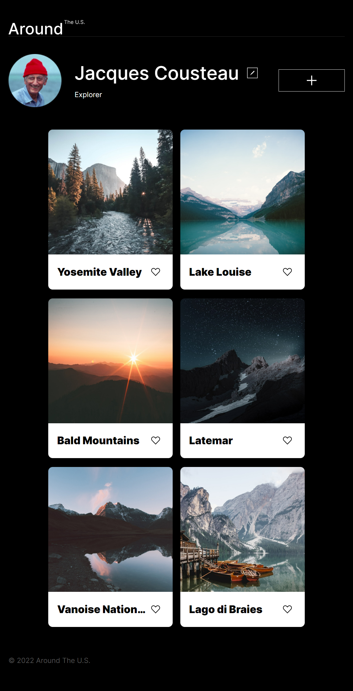
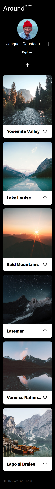

# Project 3: Around The U.S.

### Overview

- Intro
- Figma
- Website Link
- Images

### Intro

This project is made so all the elements are displayed correctly on popular screen sizes.

Technologies Used: CSS, HTML, Javascript

### Figma

- [Link to the project on Figma](https://www.figma.com/file/ii4xxsJ0ghevUOcssTlHZv/Sprint-3%3A-Around-the-US?node-id=0%3A1)

- [Link to the project on Figma](https://www.figma.com/file/E5x6ib3osaUUNwLRRAsTDX/Sprint-9-%E2%80%94-Applied-JavaScript?type=design&node-id=1-177&mode=design&t=mvUTFtHgS9An60eD-0)

### Website Link

- https://divyaaa1812.github.io/se_project_aroundtheus/

### Images

Desktop View:
.png>)

Tablet View:

Mobile View:

